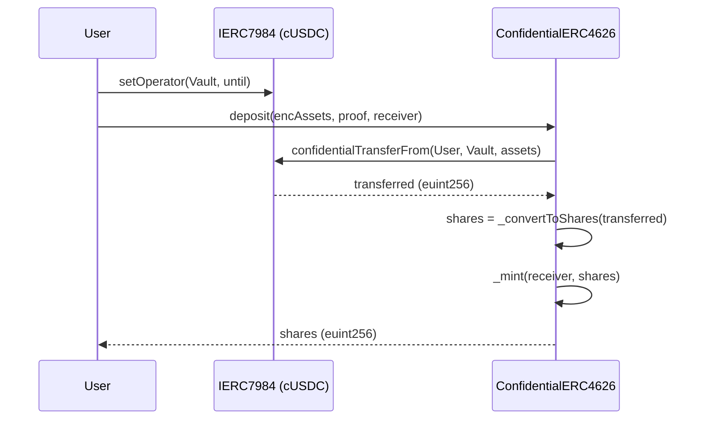
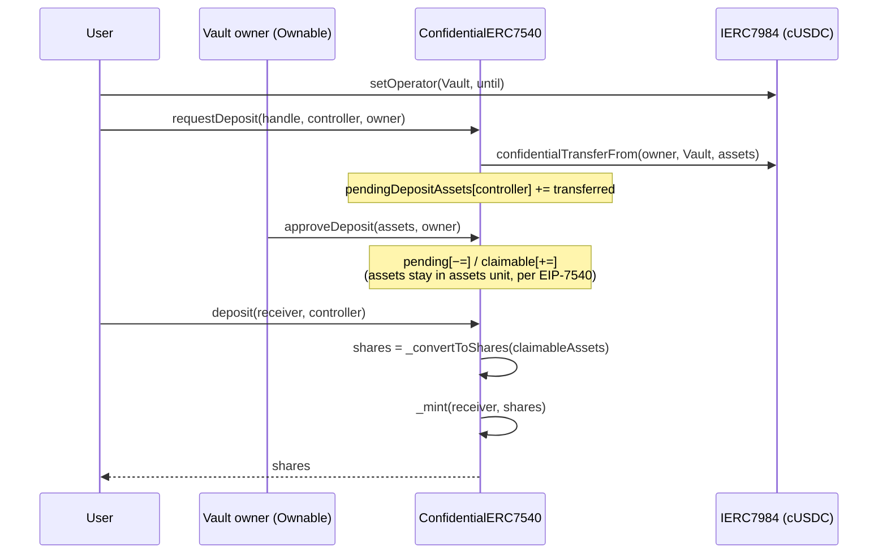

# cVault · Confidential Vault contracts

Confidential adaptation of ERC-4626 and EIP-7540, built on top of the Nox confidential-compute
primitives (`euint256`, `ebool`, …) and the [@iexec-nox/nox-confidential-contracts][nox-conf]
ERC-7984 implementation.

Spec: Confluence page ["PoC 1: Confidential Vault cERC-7984"][spec]
References: OpenZeppelin [`ERC4626`][oz4626], [EIP-7540][eip7540], [ERC-7984][eip7984].

[nox-conf]: https://www.npmjs.com/package/@iexec-nox/nox-confidential-contracts
[spec]: https://iexecproject.atlassian.net/wiki/spaces/IP/pages/4525195286/Poc+1+Confidential+Vault+cERC-7984
[oz4626]: https://github.com/OpenZeppelin/openzeppelin-contracts/blob/master/contracts/token/ERC20/extensions/ERC4626.sol
[eip7540]: https://eips.ethereum.org/EIPS/eip-7540
[eip7984]: https://eips.ethereum.org/EIPS/eip-7984

## Layout

```
contracts/
├── interfaces/
│   ├── IConfidentialERC4626.sol     — sync vault interface
│   └── IConfidentialERC7540.sol     — async vault interface
├── vault/
│   ├── ConfidentialERC4626.sol      — sync implementation (ERC-4626 + Nox)
│   └── ConfidentialERC7540.sol      — async implementation (EIP-7540, extends 4626)
├── factory/
│   └── ConfidentialERC7540Factory.sol — CREATE2 factory for vaults
└── mocks/
    └── cUSDC.sol                    — test-only concrete ERC-7984

scripts/
├── deployVault.ts                   — deploys a vault via the factory
├── requestDeposit.ts                — phase 1: wrap USDC + requestDeposit (pending)
└── claimDeposit.ts                  — phase 3: claim approved shares (claimed)

test/
├── ConfidentialERC7540Factory.ts    — local smoke test (factory + vault deploy)
└── ConfidentialERC7540.fork.ts      — Arbitrum Sepolia fork integration tests
```

## Confidentiality matrix (from the Confluence spec)

| Element                           | Confidential? | Implementation                                 |
| --------------------------------- | ------------- | ---------------------------------------------- |
| `confidentialBalanceOf(user)`     | yes           | inherited from ERC-7984 (`euint256`)           |
| `confidentialTotalSupply()`       | yes           | inherited from ERC-7984                        |
| `confidentialTotalAssets()`       | yes           | `IERC7984(asset).confidentialBalanceOf(this)`  |
| NAV (`totalAssets / totalSupply`) | public ratio  | TODO(prod): opt-in `Nox.allowPublicDecryption` |
| PnL / IRR / user APY              | always client | computed off-chain with user decryption        |

## Flows

### Sync deposit (`ConfidentialERC4626`)



### Async deposit (`ConfidentialERC7540`)



## Setup

```bash
cd cVault/contracts
npm install
npx hardhat compile
```

### Hardhat keystore (infrastructure secrets)

```bash
npx hardhat keystore set ARBITRUM_SEPOLIA_RPC_URL      # dedicated RPC URL
npx hardhat keystore set ETHERSCAN_API_KEY             # v2 unified key, one for all chains
```

### `.env` (script-level vars — loaded by dotenv-cli)

| Variable                    | Role                                                |
| --------------------------- | --------------------------------------------------- |
| `VAULT_OWNER_PRIVATE_KEY`   | Signer used by all scripts                          |
| `VAULT_OWNER_ADDRESS`       | Initial Ownable owner of vaults created via factory |
| `CUSDC_ADDRESS`             | `ERC20ToERC7984Wrapper` cUSDC used as underlying    |
| `FACTORY_ADDRESS`           | Filled by `deploy:factory:arbitrumSepolia`          |
| `VAULT_ADDRESS`             | Filled by `deploy:vault:arbitrumSepolia`            |

Copy `.env.example` to `.env` and fill. Generate a fresh dev key with:

```bash
node --input-type=module -e "import {generatePrivateKey} from 'viem/accounts'; console.log(generatePrivateKey())"
```

## Test

```bash
npm test                 # all tests (local smoke + fork)
```

The fork suite connects to Arbitrum Sepolia (chainId 421614) so `Nox.noxComputeContract()`
resolves to the live deployment at `0xd464…c229`.

## Deploy

```bash
# 1. Deploy the factory (Ignition, CREATE2, auto-verify on Arbiscan/Blockscout/Sourcify)
npm run deploy:factory:arbitrumSepolia

# → copy the printed address into .env as FACTORY_ADDRESS

# 2. Deploy a vault via the factory (CREATE2, random salt)
npm run deploy:vault:arbitrumSepolia

# → copy the printed address into .env as VAULT_ADDRESS
```

If the auto-verify fails (Arbiscan/Blockscout sometimes lag behind the tx), re-run:

```bash
npm run verify:factory                                  # factory
npm run verify:vault -- <vault> <asset> "<name>" "<sym>" "" <initialOwner>
```

## Interact with a deployed vault (async lifecycle)

The EIP-7540 lifecycle is request → approve → claim. Each phase is its own script so the
three actors (user, vault owner, user again) can be orchestrated independently.

### Phase 1 — user submits a request

```bash
npm run vault:request:arbitrumSepolia
```

What it does:
1. `USDC.approve(cUSDC, amount)` — authorise the wrapper
2. `cUSDC.wrap(user, amount)` — mint encrypted cUSDC to the user
3. `cUSDC.setOperator(vault, until)` — let the vault pull via `confidentialTransferFrom`
4. `NoxCompute.allow(balanceHandle, vault)` — persistent ACL grant to the vault
5. `vault.requestDeposit(balanceHandle, controller, owner)` → status **pending**

### Phase 2 — vault owner approves

Not scripted. The Ownable owner of the vault calls `approveDeposit(assets, owner)` with the
handle read from `pendingDepositRequest(controller)`. The amount approved should be ≤ the
current pending (over-approval is a no-op thanks to `Nox.safeSub`).

This moves the amount from pending to claimable. No conversion yet — per EIP-7540, shares are
minted at claim time at the live NAV.

### Phase 3 — user claims

```bash
npm run vault:claim:arbitrumSepolia
```

What it does:
1. Read `claimableDepositRequest(controller)` (for log only)
2. `vault.deposit(receiver, controller)` → converts to shares at live NAV, `_mint(receiver,
   shares)` → status **claimed**
3. Read the final state: user share balance handle, vault totalSupply / totalAssets handles

## End-to-end tests (Arbitrum Sepolia)

The e2e suite in `test/e2e/ConfidentialERC7540.e2e.ts` runs the full async lifecycle against
**live Arbitrum Sepolia** (chainId 421614), not a local fork. Each run:

1. Deploys a fresh vault through the factory with a randomized CREATE2 salt (state is
   isolated per run, so prior deposits / shares don't leak across invocations).
2. Wraps USDC to cUSDC, then walks the deposit lifecycle: `requestDeposit`,
   `approveDeposit`, `deposit(receiver, controller)`.
3. Walks the redeem lifecycle: `requestRedeem`, `approveRedeem`,
   `redeem(receiver, controller)`.
4. Decrypts every relevant handle (pending / claimable buckets, `totalSupply`,
   `totalAssets`, user `confidentialBalanceOf`) via the `@iexec-nox/handle` SDK and asserts
   invariants at each step: 1:1 ratio on the seed mint, pending drained on approve,
   `totalSupply` decreases by the burned shares on `approveRedeem`, cUSDC returned 1:1 to
   the signer after the redeem claim.

### Prerequisites

- Hardhat keystore: `ARBITRUM_SEPOLIA_RPC_URL` (same var used by the deploy / script tasks).
- `.env` vars:
  - `VAULT_OWNER_PRIVATE_KEY`: single signer that plays every role (user, vault owner,
    receiver). It **must** own the freshly-deployed vault so `approveDeposit` /
    `approveRedeem` succeed, and **must** hold at least `DEPOSIT_AMOUNT_USDC` atomic USDC
    (currently 10_000, i.e. 0.01 USDC).
  - `CUSDC_ADDRESS`: the deployed `ERC20ToERC7984Wrapper` (cUSDC).
  - `FACTORY_ADDRESS`: the deployed `ConfidentialERC7540Factory`.

### Run

```bash
npm run test:e2e:arbitrumSepolia
```

Under the hood: `dotenv -e .env -- hardhat test nodejs test/e2e/ConfidentialERC7540.e2e.ts`.

Unit / fork tests live in `test/unit/` and are run via `npm run test:unit` (or the default `npm test`).

### Gas cost caveat

One full run sends ~8 live transactions (wrap approve, wrap, setOperator, `Nox.allow`,
requestDeposit, approveDeposit, deposit claim, plus the full redeem leg) and consumes real
Arbitrum Sepolia gas plus real testnet USDC. That's why `DEPOSIT_AMOUNT_USDC` is kept tiny
(0.01 USDC): the suite asserts invariants on amounts, not on economic size, so there is no
reason to move more. Top up the signer from a faucet before running if needed.

## PoC simplifications (tagged `TODO(prod)` in code)

- **No slippage / `maxDeposit` / `maxRedeem` caps.** Enforced reverts on encrypted comparisons
  are not possible; a production vault would clamp via `Nox.le` + `Nox.select`.
- **Live NAV at claim time.** The EIP-7540 spec allows a snapshotted rate at approval time; we
  use the live NAV for simplicity. Production: snapshot the NAV on `approveDeposit`.
- **Singleton request mode.** Each controller has a single bucket per flow. EIP-7540 allows
  multiple concurrent `requestId`s if needed.
- **NAV disclosure.** The vault owner would need to call `Nox.allowPublicDecryption` on
  `totalAssets` + `totalSupply` (or on a pre-computed ratio) to let a frontend show NAV / APY.
- **Factory uses `new` + CREATE2.** Consider ERC-1167 minimal-proxy clones once the vault
  bytecode stabilises, for cheaper deploys with a shared implementation.
