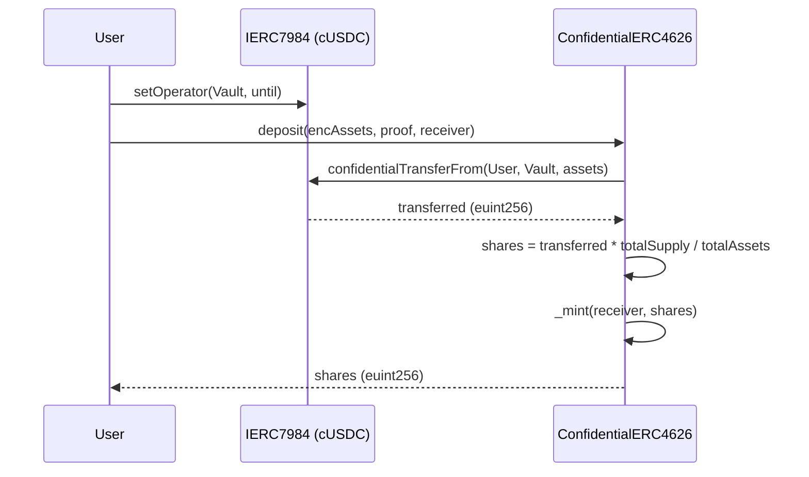
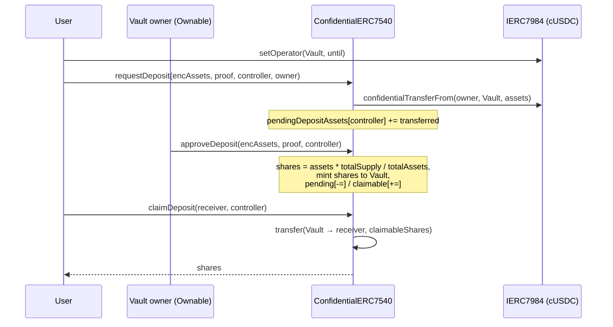

# cVault · Confidential Vault contracts

Confidential adaptation of ERC-4626 and EIP-7540, built on top of the Nox confidential-compute
primitives (`euint256`, `ebool`, …) and the [@iexec-nox/nox-confidential-contracts][nox-conf]
ERC-7984 implementation.

Spec: Confluence page [“PoC 1: Confidential Vault cERC-7984”][spec]
References: OpenZeppelin [`ERC4626`][oz4626], [EIP-7540][eip7540], [ERC-7984][eip7984].

[nox-conf]: https://www.npmjs.com/package/@iexec-nox/nox-confidential-contracts
[spec]: https://iexecproject.atlassian.net/wiki/spaces/IP/pages/4525195286/Poc+1+Confidential+Vault+cERC-7984
[oz4626]: https://github.com/OpenZeppelin/openzeppelin-contracts/blob/master/contracts/token/ERC20/extensions/ERC4626.sol
[eip7540]: https://eips.ethereum.org/EIPS/eip-7540
[eip7984]: https://eips.ethereum.org/EIPS/eip-7984

### Confidentiality matrix (from the Confluence spec)

| Element                           | Confidential? | Implementation                                 |
| --------------------------------- | ------------- | ---------------------------------------------- |
| `confidentialBalanceOf(user)`     | yes           | inherited from ERC-7984 (`euint256`)           |
| `confidentialTotalSupply()`       | yes           | inherited from ERC-7984                        |
| `confidentialTotalAssets()`       | yes           | `IERC7984(asset).confidentialBalanceOf(this)`  |
| NAV (`totalAssets / totalSupply`) | public ratio  | TODO(prod): opt-in `Nox.allowPublicDecryption` |
| PnL / IRR / user APY              | always client | computed off-chain with user decryption        |

### PoC simplifications (tagged `TODO(prod)` in code)

- **No inflation-attack protection.** OZ uses virtual shares/assets
  `shares = assets × (totalSupply + 10^offset) / (totalAssets + 1)`. Nox does not expose a
  confidential `pow` primitive today, so we fall back to a first-deposit bootstrap (`shares =
assets` on the very first deposit). A production vault should be seeded by the deployer.
- **No slippage protection.** TODO(prod).
- **Sync `mint` / `withdraw`** entry points are not exposed. Only `deposit` (by asset amount) and
  `redeem` (by share amount) are.
- **Async claim** takes `(receiver, controller)` and claims the full claimable bucket; the
  spec-compliant `deposit(assets, receiver, controller)` is a TODO because users cannot know the
  exact plaintext amount to pass in a confidential setting.
- **No multi-request support.** Each `controller` has a single pending/claimable bucket per
  flow; a second `requestDeposit` before approval simply accumulates.
- **NAV disclosure.** Not implemented. The vault operator will need to call
  `Nox.allowPublicDecryption` on both `confidentialTotalAssets()` and
  `confidentialTotalSupply()` handles (or on the pre-computed ratio) before a frontend can show
  NAV / APY.
- **Factory** is plain `new`; use CREATE2 / ERC-1167 clones in prod.

## Flows

### Sync deposit (`ConfidentialERC4626`)



### Async deposit (`ConfidentialERC7540`)



## Build

```bash
cd cVault/contracts
npm install
npx hardhat compile
```

Running scenarios end-to-end requires a chain with the Nox `NoxCompute` contract deployed (Arbitrum
Sepolia, or a local fork with the address at `0x44C0…8236`). See
[`@iexec-nox/nox-protocol-contracts`](https://www.npmjs.com/package/@iexec-nox/nox-protocol-contracts)
for the deployment scripts and the addresses.

## Deploy the factory

```bash
npx hardhat ignition deploy ignition/modules/ConfidentialVaultFactory.ts
# then from a script:
#   factory.createVault(assetAddress, "cVault USDC", "cvUSDC", "", owner)
```

## Verification

Verify deployed contracts on Etherscan. Requires `ETHERSCAN_API_KEY`:

```bash
pnpm run verify:factory:arbitrumSepolia
```

```bash
npm run verify:vault:arbitrumSepolia -- 0xVault... 0xAsset... "MyVault" "MV" "" 0xOwner...
```
